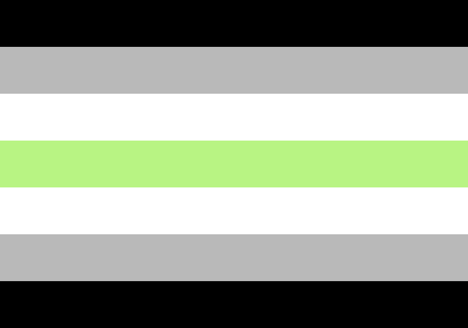
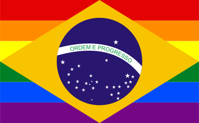
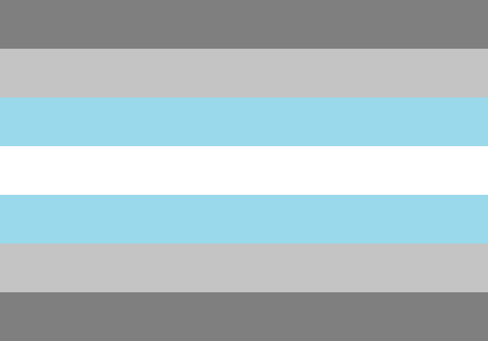
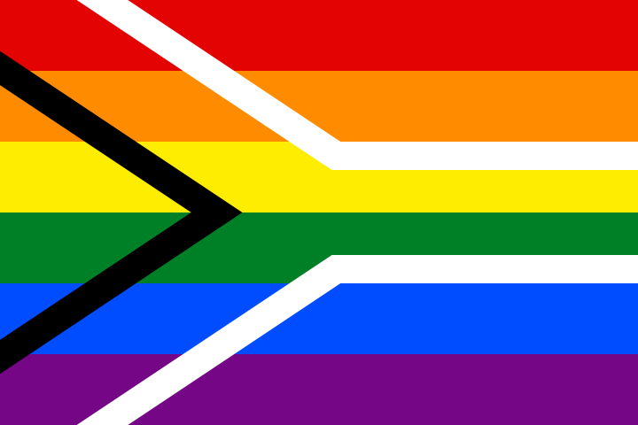
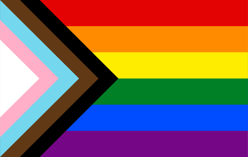
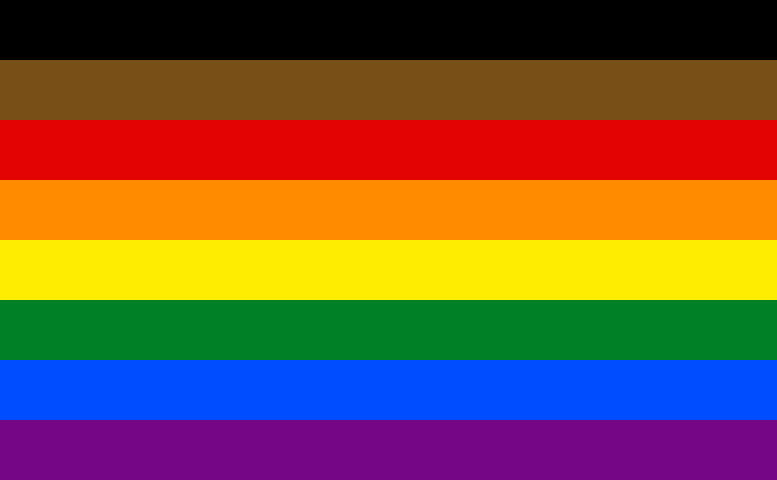

# Flags

| Name                  | Stripes | Image                                                                        |
| --------------------- | :-----: | ---------------------------------------------------------------------------- |
| Male Gay              |    5    |                            |
| Asexual               |    4    |                                            |
| Bisexual              |    3    |                                          |
| Butch                 |    7    |                                                     |
| Demisexual            |    3    |                                      |
| Male Gay              |    7    | .svg>)                                    |
| Male Gay              |    7    |                                           |
| Gay                   |    6    |                                                    |
| Lesbian: Labrys       |    6    |                                   |
| Lesbian: Double Venus |    7    |  |
| Lesbian: 2018         |    7    |                                 |
| Lesbian: 2019         |    5    |                                 |
| Lesbian: Pink         |    7    |                                 |
| Lesbian: Lipstick     |    7    |                         |
| New Gay               |    7    |                                            |
| Omnisexual            |    5    |                                         |
| Pansexual             |    3    |                                     |
| Polysexual            |    3    |                                   |
| Femme                 |    7    |                                                 |
| Vincian               |    7    | .svg)                                      |

## Outras bandeiras

| Name | Stripes | Image                                                    |
| ---- | :-----: | -------------------------------------------------------- |
|      |         |               |
|      |         |                                 |
|      |         |                                     |
|      |         |                              |
|      |         |                                     |
|      |         |                            |
|      |         |                              |
|      |         |                           |
|      |         |                                   |
|      |         |                             |
|      |         |                                 |
|      |         |                                     |
|      |         |                               |
|      |         |                                    |
|      |         |                                   |
|      |         |                         |
|      |         |                           |
|      |         |                        |
|      |         |                              |
|      |         |                        |
|      |         |            |
|      |         |                                  |
|      |         |                       |
|      |         |                           |
|      |         |                          |
|      |         |                       |
|      |         |                            |
|      |         |                             |
|      |         |                   |
|      |         |                             |
|      |         |          |
|      |         |  |
|      |         |                         |
|      |         |                         |
|      |         |                         |
|      |         |   |
|      |         |                     |
|      |         |                                  |
|      |         |                                        |
|      |         |                              |
|      |         |                                  |
|      |         |                              |
|      |         |                                  |
|      |         |                         |
|      |         |                         |
|      |         |                            |
|      |         |                        |
|      |         |                         |
|      |         |                                      |
|      |         |              |
|      |         |                                 |
|      |         |                          |
|      |         |                   |
|      |         |                                 |
|      |         | .svg)                        |
