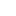
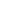
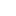
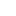

# Icons

| Name                  | Image Black                                                     | Image White                                                     |
| --------------------- | --------------------------------------------------------------- | --------------------------------------------------------------- |
| Agender               |                           |                           |
| Alternative-sexuality |             |             |
| Androgyny             | .svg)           | .svg)           |
| Androgyny             | .svg)          | .svg)          |
| Asexual               | .svg)            | .svg)            |
| Asteroid              | .svg)           | .svg)           |
| Bisexuality           |                       |                       |
| Comet                 | .svg)              | .svg)              |
| Demi-boy              |                          |                          |
| Demi-girl             |                         |                         |
| Double_crescent       |                   |                   |
| Double_Mars           |                       |                       |
| Double_Venus          |                      |                      |
| Female_bisexuality    |                |                |
| Gender                |                              |                              |
| Heterosexuality       |                   |                   |
| Inter-gender          |                      |                      |
| Male_and_female       |                     |                     |
| Male_bisexuality      |                  |                  |
| Mercury               | .svg)            | .svg)            |
| Mercury_with_arrow    | .svg) | .svg) |
| Neuter                |                            |                            |
| Non-binary            | .svg)         | .svg)         |
| Oberon                | .svg)             | .svg)             |
| Pansexual             | .svg)          | .svg)          |
| Rotated_Mercury       | .svg)           | .svg)           |

## Tabela de Símbolos

|  Hex   | Dec (Text) | Dec (symbol) | Unicode name                              | Associated wording                                            | symbol |
| :----: | :--------: | :----------: | ----------------------------------------- | ------------------------------------------------------------- | :----: |
| U+263F | `&#9791;`  |   &#9791;    | MERCURY                                   | Intersexuality                                                |   ☿    |
| U+26A2 | `&#9890;`  |   &#9890;    | DOUBLED FEMALE SIGN                       | Female homosexuality                                          |   ⚢    |
| U+26A3 | `&#9891;`  |   &#9891;    | DOUBLED MALE SIGN                         | Male homosexuality                                            |   ⚣    |
| U+26A4 | `&#9892;`  |   &#9892;    | INTERLOCKED MALE AND FEMALE SIGN          | Heterosexuality                                               |   ⚤    |
| U+26A5 | `&#9893;`  |   &#9893;    | MALE AND FEMALE SIGN                      | Intersex, androgynous. Hermaphroditic (in botany)             |   ⚥    |
| U+26A6 | `&#9894;`  |   &#9894;    | MALE WITH STROKE SIGN                     | Transgender                                                   |   ⚦    |
| U+26A7 | `&#9895;`  |   &#9895;    | MALE WITH STROKE AND MALE AND FEMALE SIGN | Transgender                                                   |   ⚧    |
| U+26B2 | `&#9906;`  |   &#9906;    | NEUTER                                    | (subheading as a gender symbol)                               |   ⚲    |
| U+26AA | `&#9898;`  |   &#9898;    | MEDIUM WHITE CIRCLE                       | Asexuality, sexless, genderless. Base for male or female sign |   ⚪︎    |
