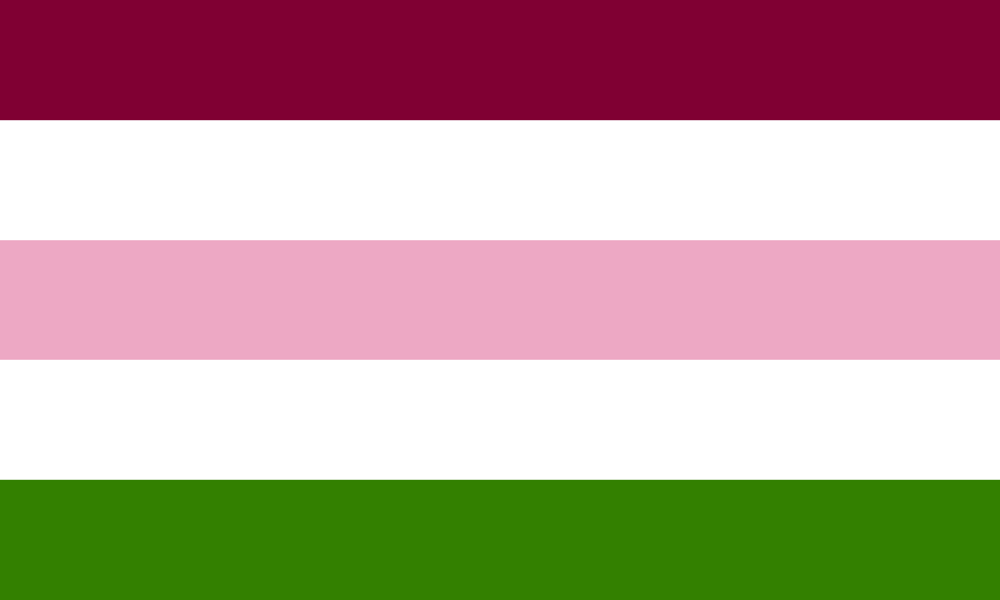

# Flags

Nonbinary-specific orientation flags!

- [More on here Later](https://lgbtqia.fandom.com/wiki/Category:Flags)
- [Also Here](https://commons.wikimedia.org/wiki/Category:LGBT_orientation_flags)
- [More Here](https://beyond-mogai-pride-flags.tumblr.com/)

## With Flags

| Cat.                                    | Name                                                    | Year | Image                                                            | Colors                            | Stripes |
| --------------------------------------- | ------------------------------------------------------- | ---: | :--------------------------------------------------------------- | --------------------------------- | :-----: |
|                                         | Demiboy                                                 |      |                              |                                   |    7    |
|                                         | Demigirl                                                |      |                             |                                   |    7    |
|                                         | Intersex                                                | 2013 |                             | Yellow, Purple                    |    1    |
|                                         | Kenochoric Loving Kenochoric (KLK) / Sablic / Caligic 1 |      |                                      |                                   |    3    |
|                                         | Kenochoric Loving Kenochoric (KLK) / Sablic / Caligic 2 |      |                                      |                                   |    3    |
|                                         | Kenochoric Loving Kenochoric (KLK) / Sablic / Caligic 3 |      |                                      |                                   |    3    |
|                                         | Maverique                                               |      |                            | Yellow, White, Orange             |    3    |
|                                         | Men who Love Men (MLM)                                  |      |                                  | Blue, White, Green                |    3    |
|                                         | Queer                                                   |      |                                |                                   |    9    |
|                                         | Sapphic                                                 | 2015 |                              |                                   |    3    |
|                                         | Two Spirit                                              |      |                           |                                   |    6    |
|                                         | Vincian                                                 |      |                     |                                   |    7    |
|                                         | Vincian                                                 |      |                                    |                                   |    5    |
| Gender                                  | Genderflux                                              |      |                           |                                   |    6    |
| Gender                                  | Transgender                                             | 1999 |                          |                                   |    5    |
| Gender Expression                       | Butch                                                   |      |                                |                                   |    7    |
| Gender Expression                       | Femme                                                   |      |                                |                                   |    7    |
| Gender Identity                         | Agender; Genderless                                     | 2014 |                              |                                   |    5    |
| Gender Identity                         | Bigender                                                | 2014 |                             |                                   |    7    |
| Gender Identity                         | Genderfluid; Fluid                                      | 2012 |                       |                                   |    5    |
| Gender Identity                         | Genderqueer                                             | 2011 |                          | Pink, White, Green                |    3    |
| Gender Identity                         | Nonbinary                                               | 2014 |                            |                                   |    4    |
| Gender Identity                         | Pangender                                               | 2015 |                            |                                   |    7    |
| Kink                                    | Leather, Latex, and BDSM                                |      |             |                                   |    9    |
| Pride                                   | Brazil                                                  |      |                          |                                   |    6    |
| Pride                                   | Canada                                                  |      |                          |                                   |    6    |
| Pride                                   | Intersex                                                |      |                        |                                   |    6    |
| Pride                                   | Philadelphia                                            | 2017 |                    |                                   |    8    |
| Pride                                   | Poland                                                  |      |                          |                                   |    7    |
| Pride                                   | Pride                                                   | 1978 |                          |                                   |    7    |
| Pride                                   | Pride                                                   | 1978 |                          |                                   |    8    |
| Pride                                   | Pride                                                   | 1979 |                          |                                   |    6    |
| Pride                                   | Progress                                                | 2018 |                        |                                   |    6    |
| Pride                                   | Serbia                                                  |      |                          |                                   |    6    |
| Pride                                   | South Africa                                            | 2010 |                    |                                   |    6    |
| Pride                                   | United Kingdom                                          | 2009 |                  | Pink, Red, White                  |    1    |
| Romantic                                | Aromantic                                               | 2014 |                          |                                   |    5    |
| Romantic                                | Gray Aromantic                                          |      |                     |                                   |    5    |
| Romantic                                | Polyamory                                               |      |                          | Blue, Red, Black, Yellow          |    3    |
| Romantic & Sexual                       | Aromantic asexual (Aroace)                              | 2018 |                               |                                   |    5    |
| Romantic: Aromantic                     | Demiromantic                                            |      |                       | White, Gray, Black, Green         |    3    |
| Romantic: Polyamory                     | Tricolor                                                |      |                 | Blue, Pink, Purple, White, Yellow |    3    |
| Sexual                                  | Abrosexual                                              |      |                           |                                   |    5    |
| Sexual                                  | Asexual                                                 | 2010 |                      |                                   |    4    |
| Sexual                                  | Bisexual                                                | 1998 |                             | Pink, Purple, Blue                |    3    |
| Sexual                                  | Demisexual                                              |      |                           | White, Gray, Black, Purple        |    3    |
| Sexual                                  | Gray Asexuality                                         |      |                      |                                   |    5    |
| Sexual                                  | Omnisexual                                              | 2015 |                        |                                   |    5    |
| Sexual                                  | Pansexual                                               | 2010 |                         | Pink, Yellow, Blue                |    3    |
| Sexual                                  | Polysexuality                                           | 2012 |                        |                                   |    3    |
| Sexual: Asexual                         | Aceflux                                                 |      |                              |                                   |    5    |
| Sexual: Diamoric                        | Feminamoric; NBLW                                       |      |                                |                                   |         |
| Sexual: Diamoric                        | Toric; Quadrisian                                       |      |                                      |                                   |    5    |
| Sexual: Diamoric                        | Trixic; Orbisian; NBLW                                  |      |                                     |                                   |    5    |
| Sexual: Monosexual: Homosexual: Gay     | Gay Men                                                 | 2019 |                   |                                   |    5    |
| Sexual: Monosexual: Homosexual: Gay     | Gay Men                                                 | 2019 |                          |                                   |    7    |
| Sexual: Monosexual: Homosexual: Gay     | Gay Men                                                 | 2019 |                              |                                   |    7    |
| Sexual: Monosexual: Homosexual: Lesbian | Double Venus                                            |      |  |                                   |    6    |
| Sexual: Monosexual: Homosexual: Lesbian | Labrys                                                  | 1999 |                     | Purple, Black, White              |    1    |
| Sexual: Monosexual: Homosexual: Lesbian | Labrys                                                  | 1999 |                       | Purple, Black, White              |    1    |
| Sexual: Monosexual: Homosexual: Lesbian | Lesbian                                                 | 2018 |                         |                                   |    7    |
| Sexual: Monosexual: Homosexual: Lesbian | Lesbian                                                 | 2019 |                         |                                   |    5    |
| Sexual: Monosexual: Homosexual: Lesbian | Pink                                                    | 2010 |                         |                                   |    7    |
| Sexual: Monosexual: Homosexual: Lesbian | Pink Lipstick                                           | 2010 |                |                                   |    7    |
| Subculture                              | Bear Brotherhood                                        | 1995 |                      |                                   |    6    |
| Subculture                              | Twink                                                   | 2009 |                                |                                   |    3    |

## Flag-less (For now)

| Cat.                                        | Name                                                                                    | Year | Image | Colors | Stripes |
| ------------------------------------------- | --------------------------------------------------------------------------------------- | ---: | :---- | ------ | :-----: |
|                                             | Asterosian                                                                              |      |       |        |         |
|                                             | Astroidian                                                                              |      |       |        |         |
|                                             | Erosian                                                                                 |      |       |        |         |
| Gender                                      | Faunagender                                                                             |      |       |        |         |
| Gender                                      | Kingender                                                                               |      |       |        |         |
| Gender                                      | Librafeminine; Librafem; Librawoman; Libragirl                                          |      |       |        |         |
| Gender                                      | Libramasculine; Libramasc; Libraman; Libraboy                                           |      |       |        |         |
| Gender Expression                           | Androgyne                                                                               |      |       |        |         |
| Gender Expression                           | Gender non-conforming (GNC)                                                             |      |       |        |         |
| Gender Identity                             | Demigender                                                                              |      |       |        |         |
| Gender Identity                             | Galactian                                                                               |      |       |        |         |
| Gender Identity                             | Multigender                                                                             |      |       |        |         |
| Gender Identity                             | Neurogender                                                                             |      |       |        |         |
| Gender Identity                             | Neurogender                                                                             |      |       |        |         |
| Gender Identity                             | Neutrois                                                                                |      |       |        |         |
| Gender Identity                             | Queer                                                                                   |      |       |        |         |
| Gender Identity                             | Xenogender                                                                              |      |       |        |         |
| Gender Identity: Galactian                  | Andromedarian                                                                           |      |       |        |         |
| Gender Identity: Galactian                  | Antiversian                                                                             |      |       |        |         |
| Gender Identity: Galactian                  | Aurorian                                                                                |      |       |        |         |
| Gender Identity: Galactian                  | Boötian                                                                                 |      |       |        |         |
| Gender Identity: Galactian                  | Calypsian                                                                               |      |       |        |         |
| Gender Identity: Galactian                  | Centriversian                                                                           |      |       |        |         |
| Gender Identity: Galactian                  | Euversian                                                                               |      |       |        |         |
| Gender Identity: Galactian                  | Lunarian                                                                                |      |       |        |         |
| Gender Identity: Galactian                  | Omniversian                                                                             |      |       |        |         |
| Gender Identity: Galactian                  | Paraversian                                                                             |      |       |        |         |
| Gender Identity: Galactian                  | Singularian                                                                             |      |       |        |         |
| Gender Identity: Galactian                  | Solarian                                                                                |      |       |        |         |
| Gender Identity: Galactian                  | Spacialian                                                                              |      |       |        |         |
| Gender Identity: Galactian                  | Spherian                                                                                |      |       |        |         |
| Gender Identity: Galactian                  | Stellarian                                                                              |      |       |        |         |
| Gender Identity: Galactian                  | Venusic                                                                                 |      |       |        |         |
| Gender Identity: Galactian                  | Voidarian; Singularian                                                                  |      |       |        |         |
| Gender Identity: Galactian                  | Voidrian; Kenic                                                                         |      |       |        |         |
| Gender Identity: Galactian: Demi-Alignments | Atmosian (Partly spacialian)                                                            |      |       |        |         |
| Gender Identity: Galactian: Demi-Alignments | Celestian (Partly stellarian)                                                           |      |       |        |         |
| Gender Identity: Galactian: Demi-Alignments | Constellian (Partly galaxian)                                                           |      |       |        |         |
| Gender Identity: Galactian: Demi-Alignments | Daenixian (Partly annulian)                                                             |      |       |        |         |
| Gender Identity: Galactian: Demi-Alignments | Dawnian (Partly solarian)                                                               |      |       |        |         |
| Gender Identity: Galactian: Demi-Alignments | Duenixian (Partly penumbrian)                                                           |      |       |        |         |
| Gender Identity: Galactian: Demi-Alignments | Duskian (Partly lunarian)                                                               |      |       |        |         |
| Gender Identity: Galactian: Demi-Alignments | Equinoxian (Partly nebularian)                                                          |      |       |        |         |
| Gender Identity: Galactian: Demi-Alignments | Eventian (Partly singularian)                                                           |      |       |        |         |
| Gender Identity: Galactian: Demi-Alignments | Hafian (Partly phoenixian)                                                              |      |       |        |         |
| Gender Identity: Galactian: Demi-Alignments | Quasarisian (Partly voidrian)                                                           |      |       |        |         |
| Gender Identity: Galactian: Demi-Alignments | Solstian (Partly novarian)                                                              |      |       |        |         |
| Gender Identity: Galactian: Demi-Alignments | Synodian (Partly siderealian)                                                           |      |       |        |         |
| Gender Identity: Galactian: Demi-Alignments | Twilightian (Partly eclipsian)                                                          |      |       |        |         |
| Gender Identity: Galactian: Demi-Alignments | Umbrian (Partly meteorian)                                                              |      |       |        |         |
| Gender Identity: Galactian: Demi-Alignments | Vialactian (Partly universian)                                                          |      |       |        |         |
| Gender Identity: Galactian: Demi-Alignments | Wanian (Partly cometian)                                                                |      |       |        |         |
| Gender Identity: Galactian: Demi-Alignments | Waxian (Partly pistolian)                                                               |      |       |        |         |
| Gender Identity: Galactian: Demi-Alignments | Xuangian (Partly boötian)                                                               |      |       |        |         |
| Gender Identity: Galactian: Multiversian    | Annulian (solarian + stellarian + spacialian)                                           |      |       |        |         |
| Gender Identity: Galactian: Multiversian    | Cometian (lunarian + spacialian)                                                        |      |       |        |         |
| Gender Identity: Galactian: Multiversian    | Eclipsian (lunarian + solarian)                                                         |      |       |        |         |
| Gender Identity: Galactian: Multiversian    | Galaxian (lunarian + solarian + stellarian)                                             |      |       |        |         |
| Gender Identity: Galactian: Multiversian    | Meteorian (lunarian + solarian + spacialian)                                            |      |       |        |         |
| Gender Identity: Galactian: Multiversian    | Nebularian (lunarian + stellarian)                                                      |      |       |        |         |
| Gender Identity: Galactian: Multiversian    | Novarian (solarian + stellarian)                                                        |      |       |        |         |
| Gender Identity: Galactian: Multiversian    | Penumbrian (lunarian + stellarian + spacialian)                                         |      |       |        |         |
| Gender Identity: Galactian: Multiversian    | Phoenixian (stellarian + spacialian)                                                    |      |       |        |         |
| Gender Identity: Galactian: Multiversian    | Pistolian (solarian + spacialian)                                                       |      |       |        |         |
| Gender Identity: Galactian: Multiversian    | Siderealian (lunarian + solarian + stellarian + spacialian)                             |      |       |        |         |
| Gender Identity: Galactian: Multiversian    | Universian (lunarian + solarian + stellarian + spacialian + singularian)                |      |       |        |         |
| Gender Identity: Galactian: Subsets         | Artemian (lunarian; feminine-aligned but not necessarily woman-aligned (selenian))      |      |       |        |         |
| Gender Identity: Galactian: Subsets         | Astraean (stellarian; neutrois-aligned but not necessarily neutral-aligned (hesperian)) |      |       |        |         |
| Gender Identity: Galactian: Subsets         | Helian (solarian; man-aligned but not necessarily masculine-aligned (phoebian))         |      |       |        |         |
| Gender Identity: Galactian: Subsets         | Hesperian (stellarian; neutral-aligned but not necessarily neutrois-aligned (astraean)) |      |       |        |         |
| Gender Identity: Galactian: Subsets         | Phoebian (solarian; masculine-aligned but not necessarily man-aligned (helian))         |      |       |        |         |
| Gender Identity: Galactian: Subsets         | Selenian (lunarian; woman-aligned but not necessarily feminine-aligned (artemian))      |      |       |        |         |
| Gender Identity: Multigender                | Bigender                                                                                |      |       |        |         |
| Gender Identity: Multigender                | Centriversian                                                                           |      |       |        |         |
| Gender Identity: Multigender                | Kymenian                                                                                |      |       |        |         |
| Gender Identity: Multigender                | Multiflux                                                                               |      |       |        |         |
| Gender Identity: Multigender                | Multiversian; Multigactian                                                              |      |       |        |         |
| Gender Identity: Multigender                | Pangender                                                                               |      |       |        |         |
| Gender Identity: Multigender                | Quadgender                                                                              |      |       |        |         |
| Gender Identity: Multigender                | Trigender                                                                               |      |       |        |         |
| Gender Identity: Multigender: Centriversian | Androgyne                                                                               |      |       |        |         |
| Gender Identity: Multigender: Centriversian | Midgender                                                                               |      |       |        |         |
| Gender Identity: Multigender: Multiversian  | Aurorian; Abrogalactian                                                                 |      |       |        |         |
| Gender Identity: Multigender: Multiversian  | Pluriversian; Plurigalactian                                                            |      |       |        |         |
| Gender: Faunagender                         | Buggender                                                                               |      |       |        |         |
| Gender: Faunagender                         | Butterflygender                                                                         |      |       |        |         |
| Gender: Faunagender: Buggender              | Beegender                                                                               |      |       |        |         |
| Gender: Faunagender: Buggender              | Beetlegender                                                                            |      |       |        |         |
| Gender: Faunagender: Buggender              | Genderbee                                                                               |      |       |        |         |
| Gender: Faunagender: Buggender              | Snailgender                                                                             |      |       |        |         |
| Gender: Faunagender: Buggender              | Wormgender                                                                              |      |       |        |         |
| Gender: Faunagender: Buggender: Genderbee   | Genderbumblebee                                                                         |      |       |        |         |
| Gender: Faunagender: Buggender: Genderbee   | Genderhoneybee                                                                          |      |       |        |         |
| Gender: Multigender                         | Bxy; Boy-X; Mxn; Man-X                                                                  |      |       |        |         |
| Gender: Paragender                          | Paraboy; paramasculine; paraguy                                                         |      |       |        |         |
| Gender: Paragender                          | Paragirl; Parafemale; Parafeminine                                                      |      |       |        |         |
| Gender: Paragender                          | Paranonbinary; Para-Nb                                                                  |      |       |        |         |
| Gender: Xenogender                          | Aesthetigender; Aesthetgender, Aesthetegender, Videgender                               |      |       |        |         |
| Gender: Xenogender: Celestarian             | Asteroidian; Asterian; Plutoian + Juparian + Lunettian + Mercurian                      |      |       |        |         |
| Gender: Xenogender: Celestarian             | Celestarian                                                                             |      |       |        |         |
| Gender: Xenogender: Celestarian             | Ceresian                                                                                |      |       |        |         |
| Gender: Xenogender: Celestarian             | Erisian                                                                                 |      |       |        |         |
| Gender: Xenogender: Celestarian             | Juparian                                                                                |      |       |        |         |
| Gender: Xenogender: Celestarian             | Kuiperian                                                                               |      |       |        |         |
| Gender: Xenogender: Celestarian             | Lunettian                                                                               |      |       |        |         |
| Gender: Xenogender: Celestarian             | Marsian                                                                                 |      |       |        |         |
| Gender: Xenogender: Celestarian             | Marsic                                                                                  |      |       |        |         |
| Gender: Xenogender: Celestarian             | Mercurian                                                                               |      |       |        |         |
| Gender: Xenogender: Celestarian             | Neptunian                                                                               |      |       |        |         |
| Gender: Xenogender: Celestarian             | Ouranian                                                                                |      |       |        |         |
| Gender: Xenogender: Celestarian             | Plutoean                                                                                |      |       |        |         |
| Gender: Xenogender: Celestarian             | Saturnian                                                                               |      |       |        |         |
| Gender: Xenogender: Celestarian             | Starfluid                                                                               |      |       |        |         |
| Gender: Xenogender: Celestarian             | Terraean                                                                                |      |       |        |         |
| Gender: Xenogender: Celestarian             | Terraric                                                                                |      |       |        |         |
| Gender: Xenogender: Celestarian             | Venusian; Juparettian                                                                   |      |       |        |         |
| Romantic                                    | Abroromantic                                                                            |      |       |        |         |
| Romantic                                    | Alloromantic                                                                            |      |       |        |         |
| Romantic                                    | Monoromantic                                                                            |      |       |        |         |
| Romantic                                    | Multiromantic                                                                           |      |       |        |         |
| Romantic: Aromantic                         | Aegoromantic                                                                            |      |       |        |         |
| Romantic: Aromantic                         | Apothiromantic                                                                          |      |       |        |         |
| Romantic: Aromantic                         | Aroflux                                                                                 |      |       |        |         |
| Romantic: Aromantic                         | Autoromantic                                                                            |      |       |        |         |
| Romantic: Aromantic                         | Bellusromantic                                                                          |      |       |        |         |
| Romantic: Aromantic                         | Cupioromantic                                                                           |      |       |        |         |
| Romantic: Aromantic                         | Desinoromantic                                                                          |      |       |        |         |
| Romantic: Aromantic                         | Frayromantic                                                                            |      |       |        |         |
| Romantic: Aromantic                         | Grayromantic                                                                            |      |       |        |         |
| Romantic: Aromantic                         | Lithromantic                                                                            |      |       |        |         |
| Romantic: Aromantic                         | Nebularomantic                                                                          |      |       |        |         |
| Romantic: Aromantic                         | Quoiromantic                                                                            |      |       |        |         |
| Romantic: Aromantic                         | Recipromantic                                                                           |      |       |        |         |
| Romantic: Monoromantic                      | Androromantic                                                                           |      |       |        |         |
| Romantic: Monoromantic                      | Ceteroromantic                                                                          |      |       |        |         |
| Romantic: Monoromantic                      | Gyneromantic                                                                            |      |       |        |         |
| Romantic: Monoromantic                      | Heteroromantic                                                                          |      |       |        |         |
| Romantic: Monoromantic                      | Homoromantic                                                                            |      |       |        |         |
| Romantic: Multiromantic                     | Biromantic                                                                              |      |       |        |         |
| Romantic: Multiromantic                     | Omniromantic                                                                            |      |       |        |         |
| Romantic: Multiromantic                     | Panromantic                                                                             |      |       |        |         |
| Romantic: Multiromantic                     | Polyromantic                                                                            |      |       |        |         |
| Sexual                                      | Adonic; Astroidian; MLNB                                                                |      |       |        |         |
| Sexual                                      | Allosexual                                                                              |      |       |        |         |
| Sexual                                      | Diamoric; Adonian; Adonic; Cypric                                                       |      |       |        |         |
| Sexual                                      | Enboric                                                                                 |      |       |        |         |
| Sexual                                      | Femellasexual                                                                           |      |       |        |         |
| Sexual                                      | Gai; Unstrayt                                                                           |      |       |        |         |
| Sexual                                      | Gynesexual; Gynosexual; Femsexual                                                       |      |       |        |         |
| Sexual                                      | Maedic; Asterian; WLNB                                                                  |      |       |        |         |
| Sexual                                      | Mestric (Diamoric + Enboric)                                                            |      |       |        |         |
| Sexual                                      | Monosexual                                                                              |      |       |        |         |
| Sexual                                      | Multisexual                                                                             |      |       |        |         |
| Sexual                                      | Queer                                                                                   |      |       |        |         |
| Sexual                                      | Strayt; Gain't                                                                          |      |       |        |         |
| Sexual                                      | Torensexual                                                                             |      |       |        |         |
| Sexual                                      | Trixensexual                                                                            |      |       |        |         |
| Sexual                                      | Zedsexual                                                                               |      |       |        |         |
| Sexual: Asexual                             | Aegosexual                                                                              |      |       |        |         |
| Sexual: Asexual                             | Apothisexual                                                                            |      |       |        |         |
| Sexual: Asexual                             | Autosexual                                                                              |      |       |        |         |
| Sexual: Asexual                             | Cupiosexual                                                                             |      |       |        |         |
| Sexual: Asexual                             | Demiasexual                                                                             |      |       |        |         |
| Sexual: Asexual                             | Demisexual                                                                              |      |       |        |         |
| Sexual: Asexual                             | Fictosexual                                                                             |      |       |        |         |
| Sexual: Asexual                             | Fraysexual                                                                              |      |       |        |         |
| Sexual: Asexual                             | Greysexual                                                                              |      |       |        |         |
| Sexual: Asexual                             | Lithosexual                                                                             |      |       |        |         |
| Sexual: Asexual                             | Requiesexual                                                                            |      |       |        |         |
| Sexual: Asexual                             | Wolandsexual                                                                            |      |       |        |         |
| Sexual: Diamoric                            | Ceteramoric; Teramoric; Ceteroamoric                                                    |      |       |        |         |
| Sexual: Diamoric                            | Contraic                                                                                |      |       |        |         |
| Sexual: Diamoric                            | Enbian; NBLNB; Owtic                                                                    |      |       |        |         |
| Sexual: Diamoric                            | Mascic                                                                                  |      |       |        |         |
| Sexual: Diamoric                            | Symmaic                                                                                 |      |       |        |         |
| Sexual: Diamoric                            | Tiric; NBLW + NBLM; Trixic + Toric                                                      |      |       |        |         |
| Sexual: Diamoric                            | Viramoric (NBLM)                                                                        |      |       |        |         |
| Sexual: Monosexual                          | Achillean                                                                               |      |       |        |         |
| Sexual: Monosexual                          | Androsexual                                                                             |      |       |        |         |
| Sexual: Monosexual                          | Ceterosexual                                                                            |      |       |        |         |
| Sexual: Monosexual                          | Gynesexual                                                                              |      |       |        |         |
| Sexual: Monosexual                          | Heterosexual                                                                            |      |       |        |         |
| Sexual: Monosexual                          | Homosexual                                                                              |      |       |        |         |
| Sexual: Monosexual                          | Sapphic                                                                                 |      |       |        |         |
| Sexual: Monosexual: Homosexual              | Gay                                                                                     |      |       |        |         |
| Sexual: Monosexual: Homosexual              | Lesbian                                                                                 |      |       |        |         |
| Sexual: Monosexual: Homosexual: Lesbian     | Lesbian                                                                                 |      |       |        |         |
| Sexual: Multisexual                         | Bisexual                                                                                |      |       |        |         |
| Sexual: Multisexual                         | Omnisexual                                                                              |      |       |        |         |
| Sexual: Multisexual                         | Pansexual                                                                               |      |       |        |         |
| Sexual: Multisexual                         | Polysexual                                                                              |      |       |        |         |
| Subculture: Bear                            | Cub                                                                                     |      |       |        |         |
| Subculture: Bear                            | Otter                                                                                   |      |       |        |         |
| Subculture: Bear                            | Wolf                                                                                    |      |       |        |         |
