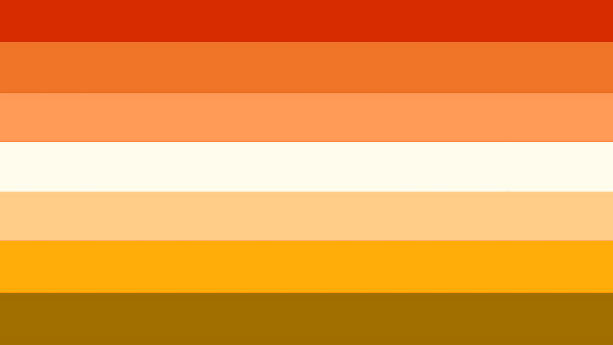
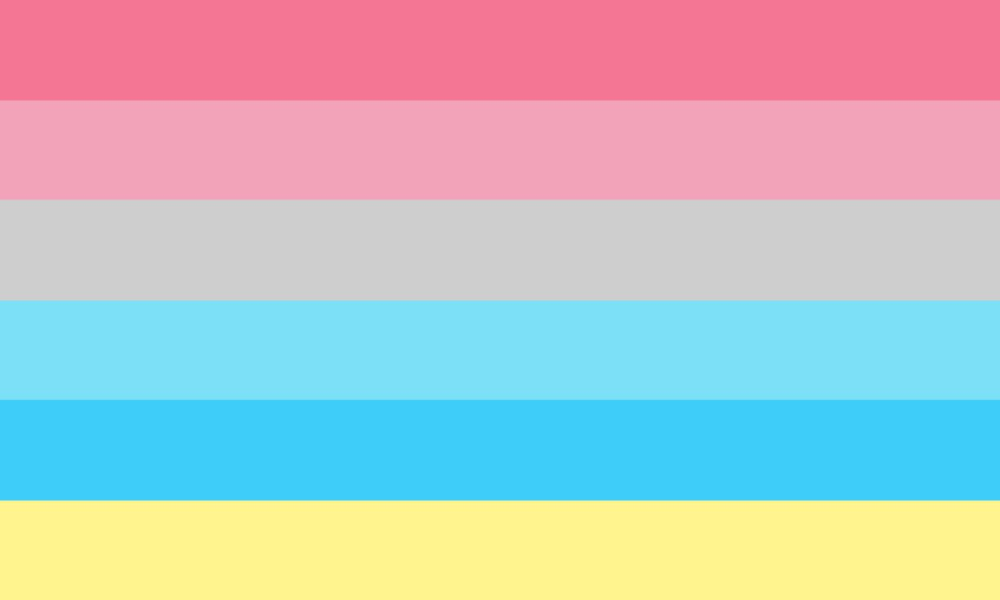
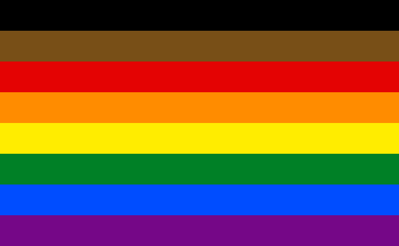
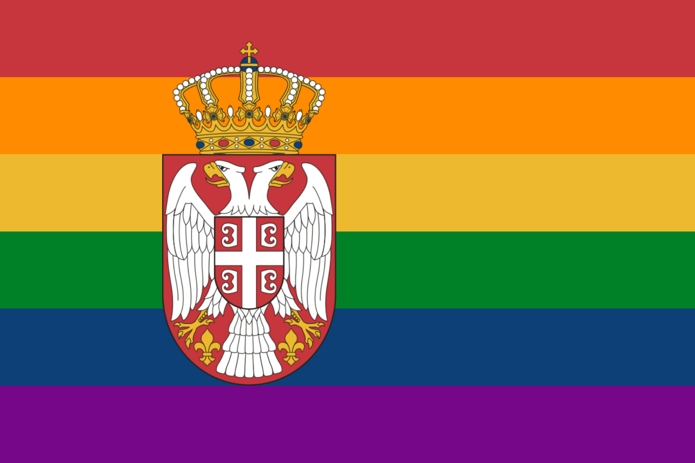

# Flags

| Stripes | Name                  | Image                                                                                |
| :-----: | --------------------- | ------------------------------------------------------------------------------------ |
|    3    | Bisexual              |                                          |
|    3    | Demisexual            |                                      |
|    3    | Pansexual             |                                     |
|    3    | Polysexual            |                                   |
|    4    | Asexual               |                                            |
|    5    | Lesbian: 2019         |                                 |
|    5    | Male Gay              |                            |
|    5    | Omnisexual            |                                         |
|    6    | Gay                   |                                                    |
|    6    | Lesbian: Labrys       |                                   |
|    7    | Butch                 |                                                     |
|    7    | Femme                 |                                                 |
|    7    | Lesbian: 2018         |                                 |
|    7    | Lesbian: Double Venus |  |
|    7    | Lesbian: Lipstick     |                         |
|    7    | Lesbian: Pink         |                                 |
|    7    | Male Gay              |                                           |
|    7    | New Gay               |                                            |
|    7    | Vincian               | .svg)                                      |

## Outras bandeiras

| Name | Stripes | Image                                                            |
| ---- | :-----: | ---------------------------------------------------------------- |
|      |         |               |
|      |         |                                 |
|      |         |                                     |
|      |         |                              |
|      |         |                                     |
|      |         |                            |
|      |         |                              |
|      |         |                           |
|      |         |                                   |
|      |         |                             |
|      |         |                                 |
|      |         |                                     |
|      |         |                               |
|      |         |                                    |
|      |         |                                   |
|      |         |                         |
|      |         |                           |
|      |         |                        |
|      |         |                              |
|      |         |                        |
|      |         |            |
|      |         |                                  |
|      |         |                       |
|      |         |                           |
|      |         |                          |
|      |         |                       |
|      |         |                            |
|      |         |                             |
|      |         |                   |
|      |         |                             |
|      |         |          |
|      |         |  |
|      |         |                         |
|      |         |                         |
|      |         |                         |
|      |         |   |
|      |         |                     |
|      |         |                                  |
|      |         |                                        |
|      |         |                              |
|      |         |                                  |
|      |         |                              |
|      |         |                                  |
|      |         |                         |
|      |         |                         |
|      |         |                            |
|      |         |                        |
|      |         |                         |
|      |         |                                      |
|      |         |              |
|      |         |                                 |
|      |         |                          |
|      |         |                   |
|      |         |                                 |
|      |         | .svg)                        |
