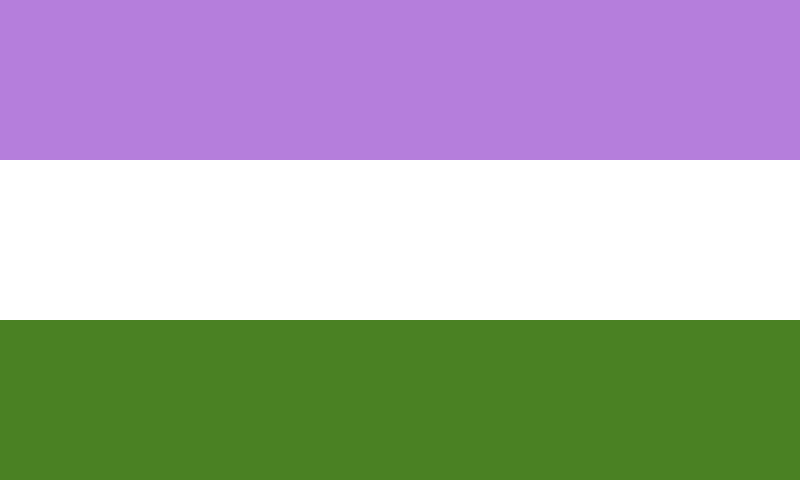
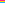

# Flags

| Colors                            | Stripes | Name                           | Image                                                      |
| --------------------------------- | :-----: | ------------------------------ | :--------------------------------------------------------- |
| Pink, Red, White                  |    1    | Gay Pride - UK                 |                      |
| Yellow, Purple                    |    1    | Intersex                       |                                  |
| Purple, Black, White              |    1    | Lesbian: Labrys                |                            |
| Pink, Purple, Blue                |    3    | Bisexual                       |                                  |
| White, Gray, Black, Green         |    3    | Demiromantic                   |                              |
| White, Gray, Black, Purple        |    3    | Demisexual                     |                                |
| Pink, White, Green                |    3    | Genderqueer                    |                               |
| Yellow, White, Orange             |    3    | Maverique                      |                                 |
| Blue, White, Green                |    3    | Men who Love Men (MLM)         |                                       |
| Pink, Yellow, Blue                |    3    | Pansexual                      |                              |
| Blue, Red, Black, Yellow          |    3    | Polyamory                      |                                 |
| Blue, Pink, Purple, White, Yellow |    3    | Polyamory (Tricolor)           |                        |
|                                   |    3    | Polysexual                     |                             |
|                                   |    3    | Sapphic (alternate)            |             |
|                                   |    4    | Asexual                        |                                   |
|                                   |    4    | Nonbinary                      |                                 |
|                                   |    5    | Abrosexual                     |                                |
|                                   |    5    | Aceflux                        |                                   |
|                                   |    5    | Agender                        |                                   |
|                                   |    5    | Aroace                         |                                    |
|                                   |    5    | Aromantic                      |                                 |
|                                   |    5    | Gay Aromantic                  |                            |
|                                   |    5    | Genderfluidity                 |                            |
|                                   |    5    | Grey Asexuality                |                           |
|                                   |    5    | Lesbian: 2019                  |                              |
|                                   |    5    | New Male Gay                   |                              |
|                                   |    5    | Omnisexual                     |                             |
|                                   |    5    | Trangender                     |                               |
|                                   |    6    | Bear Brotherhood               |                          |
|                                   |    6    | Gay Pride                      |                                       |
|                                   |    6    | Gay Pride - BR                 |                              |
|                                   |    6    | Gay Pride - CA                 |                              |
|                                   |    6    | Gay Pride - SRB                |                              |
|                                   |    6    | Gay Pride - ZA                 |                        |
|                                   |    6    | Genderflux                     |                                |
|                                   |    6    | Intersex Inclusive             |                        |
|                                   |    6    | Lesbian: Double Venus          |       |
|                                   |    6    | Progress                       |  |
|                                   |    6    | Two Spirit                     |                                |
|                                   |    7    | Bigender                       |                                  |
|                                   |    7    | Butch                          |                               |
|                                   |    7    | Demiboy                        |                                   |
|                                   |    7    | Demigirl                       |                                  |
|                                   |    7    | Femme                          |                                 |
|                                   |    7    | Gay Pride - PL                 |                              |
|                                   |    7    | Lesbian: 2018                  |                              |
|                                   |    7    | Lesbian: Lipstick              |                          |
|                                   |    7    | Lesbian: Pink                  |                              |
|                                   |    7    | Male Gay                       |                                   |
|                                   |    7    | New Gay                        |                                   |
|                                   |    7    | Pangender                      |                                 |
|                                   |    7    | Vincian                        | .svg)                       |
|                                   |    9    | Leather, Latex, and BDSM pride |          |
|                                   |    9    | Queer                          |                                     |
